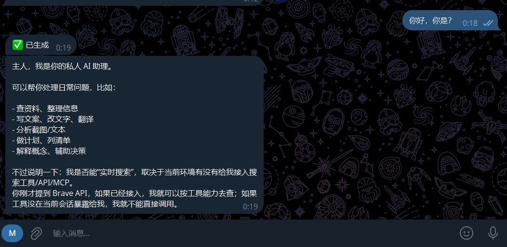
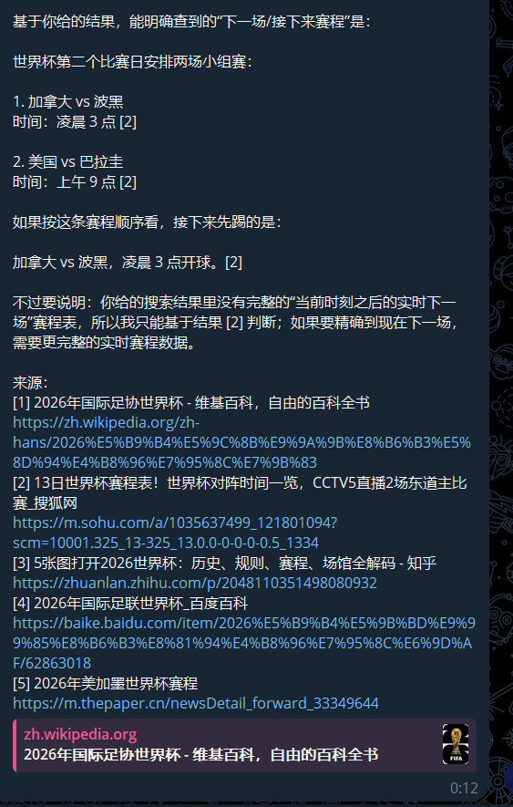
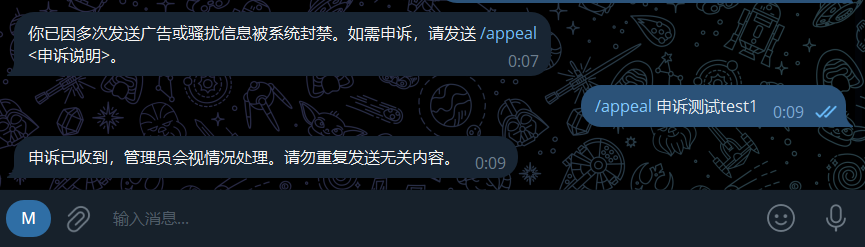
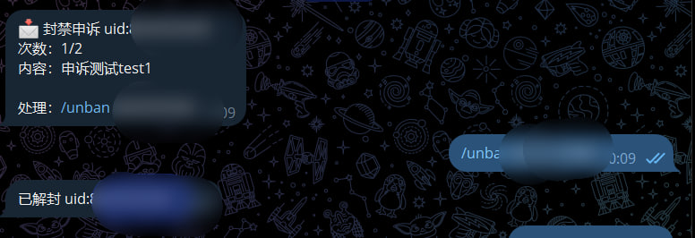

# nicechat-bot

部署在 Cloudflare Workers 上的 Telegram 个人双向聊天机器人。它不是给陌生人当免费 AI 聊天窗口,而是给你做一个带 AI 门卫、前台、代笔和私人助理的私聊中继工具。

陌生人给 bot 发消息后,系统会先做人机验证和 AI 过滤。正常消息转发给你,广告/诈骗/骚扰会被拦截并累计违规次数。你可以直接 reply 用户消息回复,也可以让 AI 根据你的意向生成代笔草稿。你自己也可以和 AI 助理聊天,并可接入搜索 API 获取联网结果。

> 当前版本以纯文本为主。图片/文件可以作为 Telegram 消息转发,但不会进入 AI 多模态理解流程。
> 用base64图片一大估计得爆，用链接又太麻烦了。不如直接纯文本助手算了。双向聊天bot又不是大龙虾咱就不要求这么多了。

## 截图

### AI 助理对话



### 自动搜索与来源



### 封禁与申诉



### 管理员收到申诉



## 核心功能

- **个人双向中继**:陌生人私聊 bot,消息转发到你的私聊;你 reply 转发消息即可回复对方。
- **AI 过滤**:广告、诈骗、垃圾骚扰先被 AI 分类,命中后不打扰管理员。
- **自动封禁**:同一用户被 AI 拦截累计 `AUTO_BAN_THRESHOLD` 次后自动 ban,后续消息不再走 AI,节省 token。
- **封禁申诉**:被 ban 用户可 `/appeal <说明>` 申诉,次数由 `APPEAL_MAX_ATTEMPTS` 控制;管理员可 `/unban <uid>` 解封。
- **AI 前台**:正常陌生人首次通过后收到模板问候,消息同步转给你。
- **AI 代笔**:reply 用户消息后发送 `/ai <意向>`,生成草稿并提供“确认回复 / 重新生成 / 自行回复”按钮。
- **AI 私人助理**:你可 `/ai <问题>` 或开启 `/aimode on` 后直接发普通消息与助理聊天。
- **模型切换**:`/model list` 查询中转站可用模型,`/model <模型名>` 动态切换。
- **自动搜索**:配置 Brave Search 或 Tavily 后,助理会自行判断是否需要联网搜索,并在回答中附来源。
- **Cloudflare 部署**:Cloudflare Workers + KV + Workers AI 绑定,无需自建服务器。

## 模型能力说明

### OpenAI 兼容接口

本项目主模型通道是 OpenAI 兼容的 `chat/completions` 接口。只要你的中转站/服务商兼容以下格式,就可以接入:

```text
POST {AI_BASE_URL}/chat/completions
Authorization: Bearer {AI_API_KEY}
```

常用配置:

```text
AI_PROVIDER=relay
AI_BASE_URL=https://your-relay.example/v1
AI_MODEL=gpt-5.5
AI_TIMEOUT_MS=80000
```

适合用来跑较强模型、慢思考模型、代笔、搜索总结和私人助理。

### Cloudflare Workers AI

项目也配置了 Cloudflare Workers AI 绑定:

```jsonc
"ai": { "binding": "AI" }
```

对应变量:

```text
AI_PROVIDER=workers_ai      # 只用 Cloudflare Workers AI
AI_PROVIDER=auto            # 主用中转站,失败时回落 Workers AI
AI_FALLBACK_TO_CF=true
CF_AI_MODEL=@cf/meta/llama-3.3-70b-instruct-fp8-fast
```

Workers AI 足够承担基础兜底、轻量过滤、简单问答等场景。对于高质量长回答、复杂推理、中文代笔和联网搜索总结,建议主通道仍使用你的 OpenAI 兼容中转站。Cloudflare 的可用模型会变化,如果备用模型不可用,换一个当前可用的 `CF_AI_MODEL` 即可。

### 够不够用?

- **过滤广告/骚扰**:够用。即使中转站不可用,关键词与 Workers AI 也能做兜底。
- **个人助理/代笔**:推荐用中转站强模型,体验更好。
- **自动搜索总结**:搜索 API 提供结果,模型负责整理,中转站强模型更适合。
- **大图/多模态**:当前未实现 AI 看图,不建议把图片塞 base64 到 Worker 链路里。

## 工作流程

```text
陌生用户 -> Telegram Bot Webhook -> Cloudflare Worker
  -> 黑名单检查
  -> 首次验证
  -> AI/关键词过滤
  -> 正常消息转发给管理员
  -> 管理员 reply 直接回复,或让 AI 代笔
```

被拦截用户:

```text
AI 判定广告/骚扰 -> 记录拦截 -> 累计违规次数
  -> 达到阈值自动封禁
  -> 后续消息不再走 AI
  -> 用户可 /appeal 申诉
  -> 管理员 /unban 解封
```

## 配置变量总表

手动网页部署时,普通变量可由 `wrangler.jsonc` 提供。Secret 必须在 Cloudflare 后台单独添加,不要写进仓库。

### Secrets

后台位置:`Workers & Pages` -> 你的 Worker -> `Settings` -> `Variables and Secrets` -> 添加时选择 Secret/Encrypt。

| 变量名 | 必填 | 说明 | 示例 |
| --- | --- | --- | --- |
| `BOT_TOKEN` | 是 | Telegram bot token,@BotFather 获取 | `123456:ABC...` |
| `BOT_SECRET` | 是 | 自定义 webhook 校验密钥,注册 webhook 时也用它 | 一长串随机字符串 |
| `AI_API_KEY` | 是 | OpenAI 兼容中转站 API key | `sk-...` |
| `SEARCH_API_KEY` | 否 | Brave Search 或 Tavily key;不填则自动搜索关闭 | `BSA...` / `tvly-...` |

### Vars

| 变量名 | 必填 | 默认/建议值 | 说明 |
| --- | --- | --- | --- |
| `ADMIN_UID` | 是 | 你的 Telegram 数字 ID | 管理员鉴权核心,@userinfobot 获取 |
| `RELAY_MODE` | 是 | `private` | 个人私聊模式;`group` 预留 |
| `ADMIN_GROUP_ID` | 否 | 留空 | 仅未来 group 模式使用 |
| `AI_BASE_URL` | 是 | 你的中转站地址 | 不要带 `/chat/completions`,如 `https://xxx/v1` |
| `AI_MODEL` | 是 | `gpt-5.5` | 默认聊天模型 |
| `AI_TIMEOUT_MS` | 否 | `80000` | AI 请求超时;慢模型建议 60000~80000 |
| `AI_PROVIDER` | 否 | `relay` | `relay` / `workers_ai` / `auto` |
| `AI_FALLBACK_TO_CF` | 否 | `true` | 中转站失败时回落 Workers AI |
| `CF_AI_MODEL` | 否 | `@cf/meta/llama-3.3-70b-instruct-fp8-fast` | Workers AI 备用模型 |
| `FILTER_ENABLED` | 否 | `true` | AI 过滤总开关 |
| `FILTER_THRESHOLD` | 否 | `0.6` | 拦截置信度阈值,越低越严格 |
| `BLOCK_KEYWORDS` | 否 | 留空 | 硬拦截关键词,用 `|` 或换行分隔 |
| `VERIFY_MODE` | 否 | `math` | 首次验证方式:`math` / `quiz` |
| `VERIFY_QUESTION` | 否 | 留空 | `quiz` 模式问题 |
| `VERIFY_ANSWER` | 否 | 留空 | `quiz` 模式答案 |
| `WELCOME_MESSAGE` | 否 | 自定义 | `/start` 欢迎语 |
| `AUTO_GREETING` | 否 | 自定义 | 前台自动身份问候;留空则不发送 |
| `AI_REPLY_PREVIEW` | 否 | `preview` | 代笔草稿模式;当前推荐 `preview` |
| `AI_CONTEXT_ROUNDS` | 否 | `6` | 助理上下文保留轮数 |
| `AUTO_SEARCH_ENABLED` | 否 | `true` | 自动搜索判断开关;需配置 `SEARCH_API_KEY` 才会搜索 |
| `SEARCH_PROVIDER` | 否 | `brave` | `brave` / `tavily` |
| `SEARCH_MAX_RESULTS` | 否 | `5` | 搜索结果数量 |
| `SEARCH_DECISION_MODEL` | 否 | 留空 | 搜索决策模型;留空使用当前模型 |
| `AUTO_BAN_THRESHOLD` | 否 | `3` | AI 拦截累计达到该次数后自动封禁;`0` 关闭 |
| `BAN_MESSAGE` | 否 | 自定义 | 被封禁用户收到的提示模板 |
| `APPEAL_MAX_ATTEMPTS` | 否 | `2` | 用户申诉次数上限 |
| `APPEAL_MESSAGE` | 否 | 自定义 | 用户提交申诉后收到的提示模板 |

### Bindings

| 绑定名 | 类型 | 说明 |
| --- | --- | --- |
| `TG_BOT_KV` | KV Namespace | 存用户、映射、封禁、草稿、上下文等状态 |
| `AI` | Workers AI | Cloudflare Workers AI 备用/兜底模型绑定 |

## 部署步骤

1. 创建 Telegram bot:@BotFather 获取 `BOT_TOKEN`。
2. 获取你的 Telegram 用户 ID:@userinfobot 获取 `ADMIN_UID`。
3. Cloudflare 创建 Worker,连接 GitHub 仓库 `TyrEamon/nicechat-bot`。
4. 创建 KV namespace,把 id 填入 `wrangler.jsonc` 的 `kv_namespaces[0].id`。
5. 在 Cloudflare Worker 的 `Variables and Secrets` 添加 Secret:`BOT_TOKEN`、`BOT_SECRET`、`AI_API_KEY`,需要搜索再加 `SEARCH_API_KEY`。
6. 确认普通 Vars 是否符合你的环境,尤其是 `ADMIN_UID`、`AI_BASE_URL`、`AI_MODEL`。
7. 部署 Worker。
8. 注册 webhook:

```text
https://<你的worker域名>/registerWebhook?secret=<BOT_SECRET>
```

9. 注册命令菜单:

```text
https://<你的worker域名>/setcommands?secret=<BOT_SECRET>
```

10. 检查状态:

```text
https://<你的worker域名>/health
```

## 管理命令

仅 `ADMIN_UID` 可用。

| 命令 | 说明 |
| --- | --- |
| reply 用户消息 + 普通文本 | 直接回复该用户 |
| reply 用户消息 + `/ai <意向>` | 生成代笔草稿,可确认回复/重新生成/自行回复 |
| `/ai <问题>` | 与私人助理对话 |
| `/aimode on` / `/aimode off` | 开启/关闭 AI 模式;开启后普通消息直接进入助理 |
| `/model` | 查看当前模型 |
| `/model list` | 查询中转站可用模型 |
| `/model <模型名>` | 切换当前模型 |
| `/model default` | 恢复默认模型 |
| `/to <uid> <内容>` | 主动给指定用户发消息 |
| `/intercepts [数量]` | 查看最近拦截记录 |
| `/ban <uid>` | 手动封禁用户;也可 reply 后 `/ban` |
| `/unban <uid>` | 解封用户并清空违规/申诉次数 |

被封禁用户可发送:

```text
/appeal <申诉说明>
```

## 自动搜索说明

配置 `SEARCH_API_KEY` 后,助理会在普通聊天中自行判断是否需要联网搜索。比如询问“今天/最新/当前/新闻/赛程/价格/版本/官网”等问题时,会调用搜索 API,再让模型基于搜索结果总结并附来源。

支持:

```text
SEARCH_PROVIDER=brave
SEARCH_PROVIDER=tavily
```

如果没有配置 `SEARCH_API_KEY`,不会调用搜索 API,也不会额外消耗搜索额度。

## 隐私与安全

- 不要把 `BOT_TOKEN`、`BOT_SECRET`、`AI_API_KEY`、`SEARCH_API_KEY` 写进仓库。
- `BOT_SECRET` 会校验 Telegram webhook 请求头,避免伪造请求。
- 管理命令必须由 `ADMIN_UID` 发出才会执行。
- 截图中请避免公开 bot token、API key、完整个人隐私信息。Telegram `uid` 不等于密钥,但仍属于可识别信息,公开仓库展示前建议打码。
- 被 ban 用户后续消息不会再走 AI,能减少 token 消耗和骚扰。

## 本地开发

```bash
npm install
cp .dev.vars.example .dev.vars
npm run dev
```

CLI 部署:

```bash
npm run kv:create
npx wrangler secret put BOT_TOKEN
npx wrangler secret put BOT_SECRET
npx wrangler secret put AI_API_KEY
npx wrangler secret put SEARCH_API_KEY
npm run deploy
```

## 当前边界

- 暂不支持 AI 看图。图片/文件可转发,但不会被模型理解。
- 管理群/话题模式保留为未来扩展,当前主模式是个人私聊。
- 搜索依赖第三方搜索 API,搜索质量取决于 provider 与查询结果。
